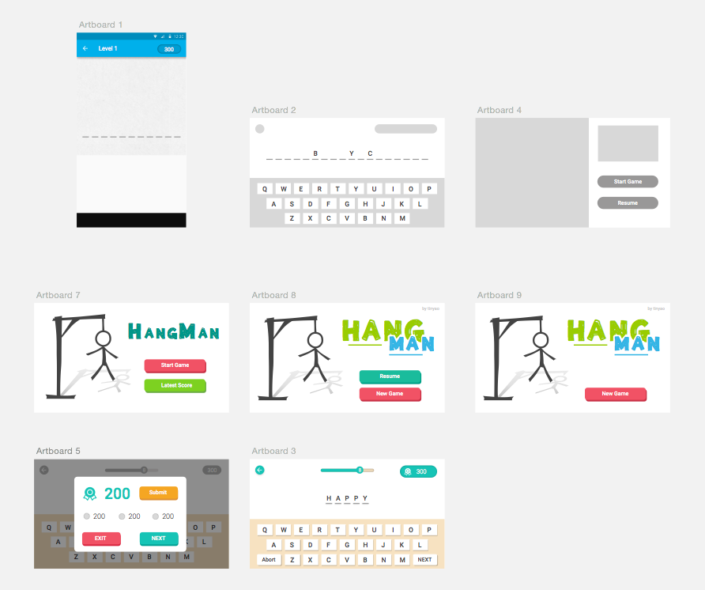
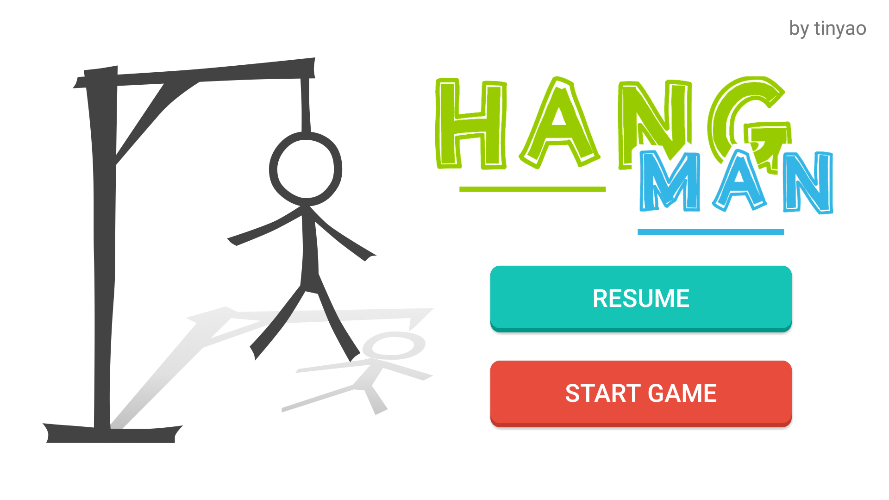
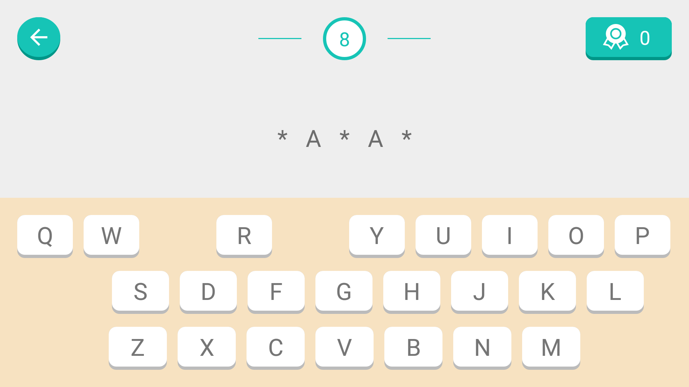
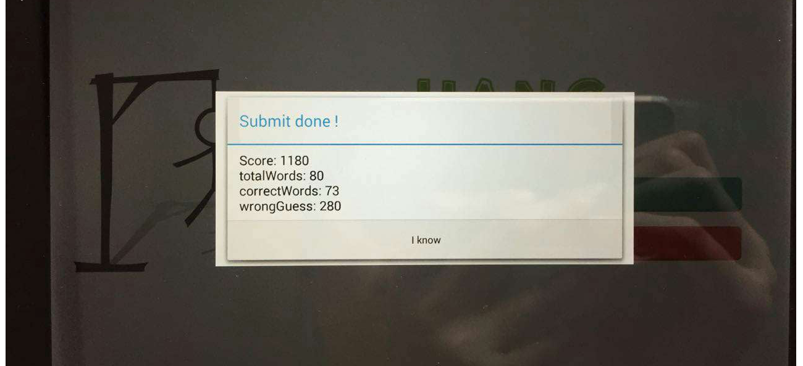

## Hangman 

### Introduction
This is a Android Client for the Strinkingly Hangman Interview Test. 

### Implementation

#### 1. Mockup Design
Use Sketch to build a mockup quickly, and polish. Export element designed for programming.



* Player can start a new game
* Player can resume the latest game
* Player can see the guessing word
* Player can guess by letter
* Player can see wrong guess by the word
* Player can see total score currently
* Player can play next when finish current one
* Player can submit its score
* Player can exit
* Player can remove see the letter have guessed.

The final implementation is as follows:

* Home Screen


* Game Screen


* Result Dialog


#### 2. Programming
 The whole java code contains serval package, aims to `Adapter`, `Hangman API`, `Molude`, `Activity/Fragment`, `Custom View`.
 
```
- im.ycz.hangman
  - adapter
	- FakeKeyboardAdapter.java
  - api
    - HangmanApi.java
    - HangmanResponse.java
    - NetClient.java
  - module
    - Hangman.java
    - Score.java
  - ui
    - dialog
	  - ResultDialog.java
	- view
	  - LetterSpacingTextView.java
	- BaseGameActivity.java
	- HomeActivity.java
	- MainActivity.java
```

* User single hangman instance for gaming.
* Use OkHttp for Network Request, HomeActivity & MainActivity extends from BaseActivity, the BaseGameActivity impliments OkHttp Callback, and parse Json response, than HomeActivity and MainActivity handle the parsed response by its need.
* Make a `Fake Keyboard` by three gridview, honestly, this is not good. A custom view should be implemented.
* Custom TextView to support letter spacing lower than lollipop
* Display well for both phone and tablet.

#### 3. Gaming

After play the game once and once again, I got `1180` finally. And, To be honest, I actually archieve this score, partly with website help (similar as `crossword solving`). 



---

This is a really interesting interview test. No matter what result it end with, I like the task, I enjoy the time working on it.

 As I told some friends, the task not only test my programming skills, and it reflact my vocabulary and logical thinking. It is really a stone kills many birds. The experience is different as my previous interviews. It is more carefully designed. I think Strinkingly must be interesting, open and careful. 

Wish to 